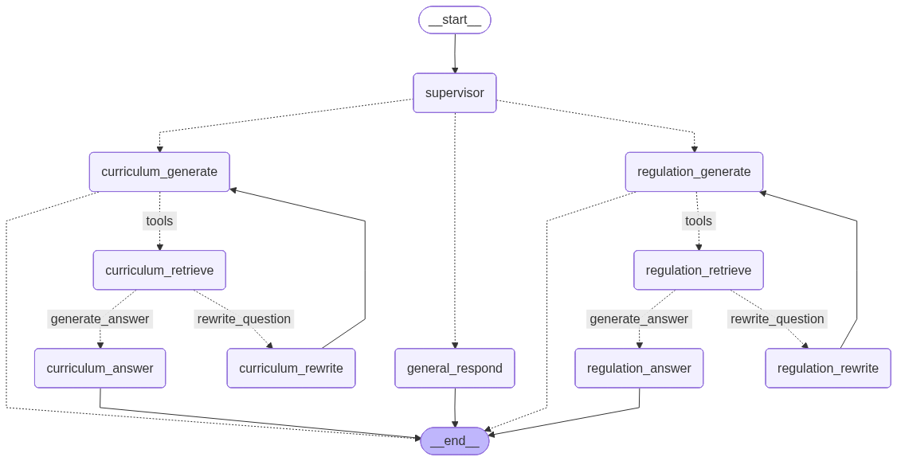

# HAUI Agent — Project Overview

**HAUI Agent** is a multi-agent system that helps students and faculty at Hanoi University of Industry (HAUI) — Faculty of Information and Communication Technology (SICT) — look up information about academic programs, university regulations, and the student handbook. It uses a Supervisor-Worker architecture built on LangGraph, where specialized RAG agents handle retrieval and generation for each knowledge domain.

## Key Features

- **Supervisor Routing** — A Supervisor node classifies each query and routes it to the appropriate specialist agent or returns a direct response
- **Dual RAG Workers** — Separate retrieval-generation pipelines for academic programs (`curriculum`) and university regulations (`regulation`)
- **Adaptive Query Rewriting** — If retrieved documents are not relevant, the agent automatically rewrites the query and retries retrieval
- **General Fallback** — Queries that don't require document lookup are answered directly via `general_respond`
- **Vietnamese Language Support** — All prompts and data are in Vietnamese

## Agent Graph



The graph above shows the full LangGraph node structure. Every request starts at `__start__`, passes through the **Supervisor**, then follows one of three paths:

| Path | Nodes | Description |
|------|-------|-------------|
| **Curriculum** | `curriculum_generate` → `curriculum_retrieve` → `curriculum_answer` or `curriculum_rewrite` | Answers questions about academic programs and course structures |
| **Regulation** | `regulation_generate` → `regulation_retrieve` → `regulation_answer` or `regulation_rewrite` | Answers questions about university policies and rules |
| **General** | `general_respond` | Handles greetings and questions that don't need document retrieval |

Each RAG path follows a **retrieve → grade → answer** loop. If the grader marks retrieved documents as irrelevant, the agent rewrites the query (`rewrite_question` edge) and loops back to generate a new retrieval query. When documents are relevant, the `generate_answer` edge sends the context to the answer node, which writes the final response and exits to `__end__`.

## Quick Start

### 1. Install Dependencies

```bash
pip install -r requirements.txt
```

### 2. Configure Environment

```bash
cp .env.example .env
# Fill in OPENROUTER_API_KEY and other environment variables
```

### 3. Build FAISS Vector Index

Run once per domain before starting the application. Requires `OPENROUTER_API_KEY` to be set in `.env` (used to embed text via `openai/text-embedding-3-small`).

```bash
# Index for academic programs
python scripts/build_index.py \
    --input data/curriculum_chunks.json \
    --index faiss_curriculum.bin \
    --meta  faiss_curriculum_meta.pkl

# Index for university regulations
python scripts/build_index.py \
    --input data/regulation_chunks.json \
    --index faiss_regulation.bin \
    --meta  faiss_regulation_meta.pkl
```

| Argument | Required | Description |
|----------|----------|-------------|
| `--input` | Yes | Input chunks JSON file |
| `--index` | Yes | Output FAISS index file (`.bin`) |
| `--meta` | Yes | Output metadata file (`.pkl`) |
| `--model` | No | Embedding model (default: `openai/text-embedding-3-small`) |

Once complete, the following 4 files will appear in the project root and are loaded automatically on startup:

```
faiss_curriculum.bin
faiss_curriculum_meta.pkl
faiss_regulation.bin
faiss_regulation_meta.pkl
```

### 4. Run the Application

```bash
# Web interface (Streamlit)
streamlit run app.py

# Interactive CLI
python main.py
```

## Directory Structure

```
Haui_Agent/
├── app.py                      # Streamlit web UI
├── main.py                     # CLI entry point
├── agent.py                    # Agent entry point
├── requirements.txt
├── .env.example
├── graph_schema.png            # Agent workflow diagram
│
├── data/                       # Source data (JSON chunks)
│   ├── curriculum_chunks.json
│   ├── regulation_chunks.json
│   └── web_chunks.json
│
├── scripts/                    # Data pipeline
│   ├── crawl_website.py        # Crawl data from the website
│   ├── split_chunks.py         # Classify chunks by domain
│   └── build_index.py          # Build FAISS indexes
│
├── faiss_curriculum.bin/.pkl   # Vector index — academic programs
├── faiss_regulation.bin/.pkl   # Vector index — university regulations
│
├── src/
│   ├── config.py               # Runtime configuration
│   ├── models.py               # Pydantic schemas
│   ├── agent/                  # LangGraph multi-agent
│   │   ├── graph.py            # Graph definition and compilation
│   │   ├── nodes.py            # Node functions (generate, answer, rewrite)
│   │   ├── supervisor.py       # Supervisor routing logic
│   │   ├── tools.py            # Retrieval tools
│   │   ├── state.py            # AgentState definition
│   │   └── prompt.py           # All prompts
│   ├── llm/                    # LLM client wrapper
│   └── service/                # VectorStore service
│
└── docs/                       # Project documentation (this directory)
```

## Documentation

| File | Contents |
|------|----------|
| [architecture.md](architecture.md) | System architecture, request flow, components |
| [data-pipeline.md](data-pipeline.md) | Data collection, classification, vector index building |
| [configuration.md](configuration.md) | Environment variables, model configuration, customization |
| [development.md](development.md) | Extension guide, adding new agents/nodes |
| [api-reference.md](api-reference.md) | API class and function reference |

## Technology Stack

| Library | Role |
|---------|------|
| LangGraph | Multi-agent workflow orchestration |
| LangChain | Abstractions for LLM and tool calling |
| FAISS | Vector similarity search |
| OpenRouter | LLM API gateway (Gemini, Claude, etc.) |
| Streamlit | Web UI |
| Pydantic | Data validation |
